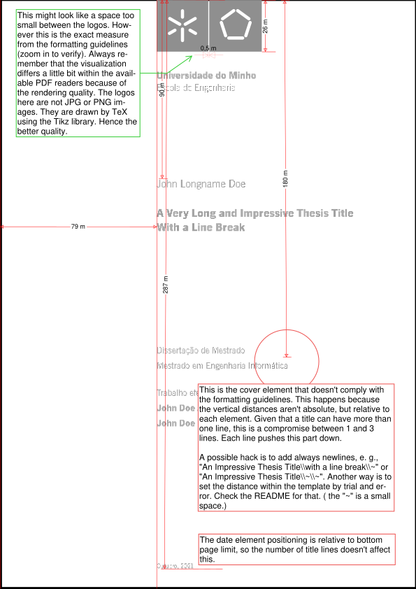
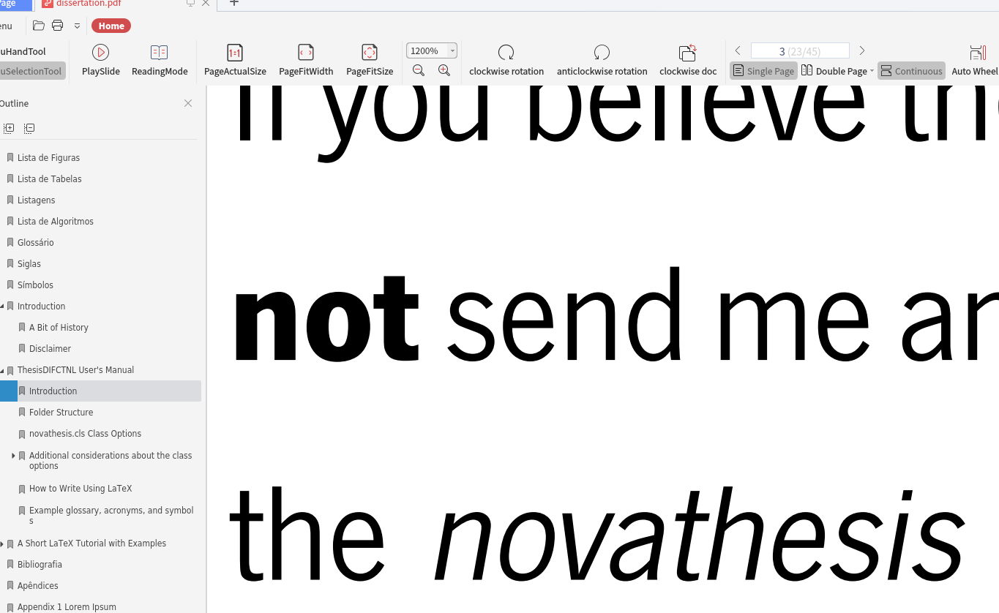
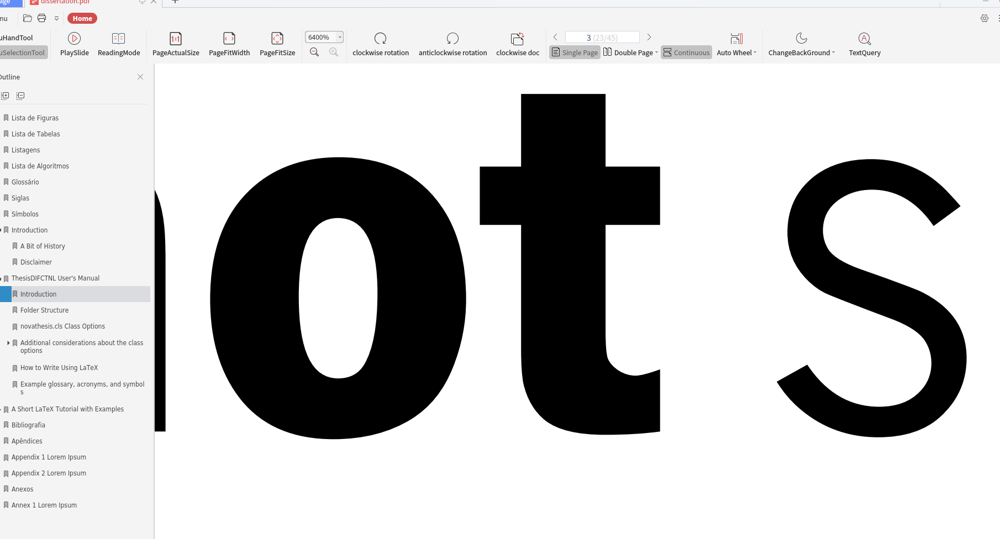

# UPDATE TO STABLE VERSION FROM _MARCH 24TH, 2021_ (FOR THE ENHANCEMENTS BELOW UPDATE TO STABLE VERSION _NOVEMBER 27TH, 2021_)

# NOVAthesis LaTeX template UMINHO Version


> The NOVAthesis LaTeX class is a thesis template initially designed for the PhD and MSc thesis at [FCT Universidade NOVA de Lisboa (FCT-NOVA)](http://www.fct.nova.pt), Portugal. The class provides utilities to easily set up the cover page, the front matter pages, the page headers, etc. with respect to the official guidelines of the FCT-NOVA for writing PhD dissertations.

> The template is easily customizable, including the support for other institutions as well. Currently the template supports out-of-thebox (at least): 17 Chapter Styles, 7 font sets, 4 schools.  If you customize this template for your institution or add new style files, please [let me knwow](http://docentes.fct.unl.pt/joao-lourenco) about the thorns in the process, so that I can work a bit to smooth them.  Thanks!

*This work is licensed under the Creative Commons Attribution-NonCommercial 4.0 International License. To view a copy of this license, visit http://creativecommons.org/licenses/by-nc/4.0/.*


## Getting Started

### Original

The original repository is in [github.com/joaomlourenco/novathesis](https://github.com/joaomlourenco/novathesis)

### Problems and Difficulties

> Check the [wiki](https://github.com/joaomlourenco/novathesis/wiki) and have some hope! :smile:

However this version is fork from an old version. Some of the information the NOVAThesis main repository doesn't apply to this version.

For this particular version you can contact me via Facebook via PM or by email. My profile is [https://www.facebook.com/pereirabruno05/](https://www.facebook.com/pereirabruno05/) and my email [pereirabruno05@gmail.com](mailto:pereirabruno05@gmail.com)

# Important issues

Some standards of this template don't meet the [RT-31/2019 Standards For Formatting Doctoral Theses And Master's Works](https://alunos.uminho.pt/PT/estudantes/Formataes/1_Despacho_RT-31_2019.pdf). They are:

1) The Abstract must have the title of the thesis;

Other elements might be not exactly as mandated in the standards like _elements metrics and colors from the cover and front page_. **As far as i know**, there is a differentiation between the _digital version_ and _the printed one_, and UM don't stress the exact metric standards from the former as they do in the latter **at least with master's dissertations**. For the doctoral thesis, the case is different. Whilst **the printing companies will deal with the printed version cover and front page**, for instance the stationary stores near _campi_, that already have the the Adobe Illustrator file for that effect, **the cover and back-cover must be like it is in Manual from the Standards - Full Cover and Full Back-Cover.** In meanwhile, you have to edit the  _Ai_ file in [here](https://alunos.uminho.pt/PT/estudantes/Formataes/Capas.zip), remove the excess border of 3mm (in Inkscape just export with a margin of -3.0mm), and the final covers must have the final size of 440x210mm (2 A4 pages plus a spine of 2cm - while the spine's width is irrelevant, the exported PDF will have that margin). **I'll post THE quickfix here that I HAVE in the meantime, so don't worry**. 

**EDIT:** The previous template as in the **stable version from March 2021** (IF YOUR VERSION IS BEFORE THIS DATE, PLEASE UPDATE) had the following format in the logo. **The light gray one was supposed to be like the UM logo color** and **they had to be separated by 0.5mm.** Also,  the code of **the School of Engineering Logo** was taken from other template and it **was wrong** - the center of the [circle that makes the] pentagon was misplaced and the radius was calculated from the outer margin of each bar. The code was corrected taking in accout to draw each bar from each bar center to the pentagon center.  


The reason to maintain this, is that many dissertations were delivered with this and it was not enough to be rejected. **As I said before, UMINHO don't stress that with the dissertations, given that many were in fact delivered and nothing was said.** However, **given that some supervisors misunderstood what I said and compeled some of my colleagues to change the template** I fixed that.  As from now **November 27th, 2021, the template is stable.** This update might not be necessary. However the March 2021 is, because it has bug fixes and not enhancements.


**Maybe I might be nitpicking at some irrelevant details.** For what I said in the previous paragraph, some supervisors mandated that the student completely change from this one the main NOVAThesis *template*. **Because some of you are still using this template and to *ensure to the supervisors that this template is 99.99% compliant*** with the Doctoral Theses and Master's Works' Formatting Standards - less the doctoral theses covers, back-covers and spines - I will show what I meant in the first paragraph with following figure:



As I noted in the image, there's a way to put the exact match to the 180mm for the elements near the circle. This template supports 3 UM Schools: School of Engineering, School of Science and School of Medicine. To make this change you have to go to the folder `/novathesis-files/Schools/um`. There are 3 folders for each school and the code is somewhat the same: `eeng`, `ec` and `emed`. Choose your school and open the file `defaults.clo` and find this code snippet:

```latex
% Advisers
\coveritem[l]{2}{%
\optionaladvisers{
  \fontsize{14pt}{16.8pt}\selectfont%
  \thedissertationstr[\novathesis@opt@docdegree,\novathesis@opt@coverlang]\\[6mm]%
  \fontsize{14pt}{16.8pt}\selectfont%
  \theadviserslabel[\novathesis@opt@coverlang]\\%
  \fontsize{14pt}{16.8pt}\selectfont%
  \textbf{\printadvisersaslist}%
\\\rule{0pt}{6mm}
    }
}
```

The second parameter of`\coveritem[l]{2}`  is the spacing, in this case 2. This command with an integer as parameter, will put somewhat spaced in that amount, e. g., 1 - one big space, 2 - two big spaces, etc. Note that this is relative to the content and the available space. However if you can put a quantity with a measure unit, to set the exact space you want. The measure units for vertical alignment are: `ex`, `mm`, `cm` and`in`. `em` is for horizontal alignment. As an example, you can set to `\coveritem[l]{20cm}`.

However if you are not content with what was said, the UM's Informatics Department published a [PDF with forms](https://mei.di.uminho.pt/sites/default/files/Capa-MIMEI.pdf) where you can edit the content for a UM Engineering School's master's dissertation

## Notes on the font quality 

This particular version of the template uses microtypography with **XeLaTeX** and **LuaLaTeX**. The main template version doesn't support it at all. **XeLaTeX** support for microtypography is somewhat limited: it only allows protusion. On the other hand, **LuaLaTeX** has more features. Something important to bear in mind is that it is MICROtypography. If you try to see the differences solely and directly in the PDF, chances are that you can't see the differences. Even that the changes are slight, the text is adjusted to better readabilty. You can see the behaviour between XeLaTeX and LuaLaTeX in the following GIF links. The ones that stretch the text (named novathesis-8.pdf) are from the LuaLaTeX.

https://gifyu.com/image/i66D

https://gifyu.com/image/i66B

https://gifyu.com/image/i66y

For the font quality, in some PDF viewers that have more render quality, you can notice a shimmering effect. That's because of the aliasing (an effect that happens with high quality photographs for instance like 4k). **So there's nothing wrong with the template.** Maybe you are using a high-resolution display and didn't noticed this. To score the point home, check the following samples from Kinksoft's WPS PDF Reader. The first is zoomed to **1200%** the second is zoomed to **6400%**. **As you can see, the resolution is very good, if not excellent.** And **it zoomed in here** to fit the page.







## HOW TO


## 1) Fundamentals

**NOTE 1**: To use in Overleaf, just get the copy of the repository in the ZIP file and upload the file. Note that **the template only works with the XeLaTeX or LuaLaTeX compilers** so you have to change as shown in https://it.overleaf.com/learn/how-to/Changing_compiler from **PDFLaTeX to XeLaTeX or LuaLaTeX**. Likewise, the recommended **Tex Live version to use is 2019** and change the version just below the compiler (same for Linux). To use on Linux there is a Makefile and it's just `make install`; `make debug` for compiling and debugging or `make` for compiling less verbose and **faster**. 

**NOTE 2**: In addition to the `msc` option, there is also `mscplan` for the 'RPD' (pre-dissertation report), `phdprop` for the thesis proposal, `phdplan` for an eventual intermediate thesis report. The `bsc`, which would be used for a final graduation report, is not implemented. 

**NOTE 3**: Additionally, following some requests from people from the Masters in Mathematics and Applications and the Doctorate in Medicine, I created two versions for the School of Science and the School of Medicine, in addition to the existing version of the School of Engineering. 

**NOTE 4**: Given that the thesis and dissertation formatting rules are the same for all UMINHO schools and institutes, just changing the UOEI logo, it is possible that I implement commands to generate the logos of other schools. I recognize that LaTeX is not the type of many people, particularly people who are not from the STEM (Science, Technology, Engineering and Math) fields. However, I didn't want to pass up the opportunity to anyone who wants to do it, whether in the fields of Arts, Humanities, Economics and Management, as well as Psychology, Nursing, etc. 

**NOTE 5**: If you think the math fonts are too small, put `\DeclareMathSizes{12}{13}{12}{11}` in the preamble of the document. Note that the first size must be the same as the rest of the document, that is, 12pt in normal font also `\DeclareMathSizes{12}{...` To know what is what in this macro see https://www.texfaq.org/FAQ-mathsize. Equally important about equations and formulas in LaTeX, don't use blank lines before or after the equations. If you want to have empty lines in the source code just insert percent signs to prevent the paragraph effect. 

 **NOTE 6**: To change the school, just change `um/eeng` to `um/ec` or `um/emed` and change the name of the master's or doctoral degree according to the examples in `main.tex`. It works on Linux (Ubuntu, Mint) and importing directly into Overleaf. I haven't tested for Windows with MikTex, so I'll probably have to change the way fonts are read by the template. If you need help, please send PM to Facebook or email me. 

**NOTE 7:** Instructions for the template's configuration is the `main.tex` file. **Please read them.** There's everything that you need to know for customizing the template, like bibliography, link colors, etc. **Please also note** that some configurations cannot be changed, like the **font type** and **oneside** options. The font type because this template's version doesn't has case control for other fonts. So if you change it, it will give you an error. **The oneside option** is set like that and **you must not change it.** The UMINHO standards **mandate that there must be no blank pages.** This can be confusing at first glance, because if you wan't to print the thesis or dissertation the **twoside** option works better because it gives a blank page before a chapter. **One of the caveats** of **oneside** is that the headers will not be like in a book: odd and even pages have the header different (outwards the page), because is for printing. If you find yourself **wanting to change to twoside**, just note that the requirements expressly say no to blank pages.

A configuration that might be unnoticed is the copyright. The following code (with comments) is the preamble of `main.tex`.

```latex
%------------------------------------------------------------------
% IMPORTANT --- LICENSING 
%------------------------------------------------------------------

%%%%%%%%% Important package for the licensing. 
\usepackage[
    type={CC},
    lang=portuguese,%*
    modifier={by-nc-sa},
    version={4.0},
]{doclicense} % By default english is used, however  is necessary to
% explicity define the language if the license is in portuguese. The
% modifier must be changed accordingly to user preferences.  If the
% licensing is different from any of the Creative Commons (all rights
% reserved for instance) just uncomment the line with \copyrightfile below
% and add your own custom file and the doclicense package will be ignored.
% Here the custom file has the name copyright

%%%%%%%% The custom copyright file. 

%\copyrightfile{copyright} % Uncomment to include yours. There is
% a template in the Chapters folder with a defined command, but you can
% change however you want.

```

Marked with an * is the language. This isn't automatic. If you're writing in english, just comment that line. The modifier options can be found in the package documentation in https://www.ctan.org/pkg/doclicense. Also, because your copyright can be different like "All rights reserved", I managed to make the template use such a file. If you want, you can find the file under the `\Chapters` folder, include what you want and uncoment the above line. The template will use that and ignore the `doclicense` one.

## 2) The Abstract must have the title of the thesis;

As it is, you can use the macro `\thetitle` as in `\textbf{\thetitle}` in the abstract. However, further customization has to be added to differentiate between languages. As it is `\thetitle` refers to the document's main title in that language. Other shortcut is to copy and paste the title in the language that is supposed to.


### Extras

#### 1 If you want to remove the signature line from the statement of integrity:
Find this highlighted line in the `novathesis.cls` file and comment it.


## Resources

[TexBlog](https://texblog.org/)
[Awesome Latex](https://github.com/egeerardyn/awesome-LaTeX)


